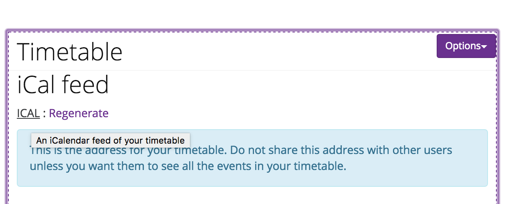

# CSTimetableConverter

## Installation

1. Clone or download repository

2. Within directory install requirements:

	```
	pip install -r requirements.txt
	```

3. Fill in calendar URL in `load_timetable.py` (available from MyManchester):

	```
	url = ''
	```

	The timetable widget can be found within on the MyManchester homepage:
	


	The URL can be found in the edit section of the widget:
	
	
4. Edit converted name:

	```
	'COMP25111':'Operating Systems',
	'COMP26120':'Algorithms and Imperitive Programming',
	'COMP28411':'Computer Networks'
	```
	
5. Run the script:

	```
	python load_timetable.py
	```
	
6. Import as a new calendar

7. Run regularly to ensure calendar remains up to date (see Calendar Updates)

--------

## Split Calendar

By default the `load_timetable.py` script can be used to create 4 different calendar files based on event description e.g if event contains "LECTURE" in description put it in the Lecture calendar.


The groupings are Labs, Lectures, Workshops / Examples and Other (as seen below).


If prefered just a single calendar then it can be exported by setting:

```python
split_calendar = False
```
and running the script.

## Calendar Updates

After the first run the script will check for updates in the calendar and then re-write the calendar files.

Example console output for deleted, added and updated:

```
> Checking for changes to timetable...

Deleted Events:
	COMP30040 on 2018-09-21 11:00:00
	COMP33511 on 2018-10-26 16:00:00
	COMP33511 on 2018-09-25 17:00:00
	COMP30040 on 2018-09-19 15:00:00

Added Events:
	COMP30040 on 2018-09-21 11:00:00
	COMP33511 on 2018-09-25 17:00:00
	COMP33511 on 2018-10-22 17:00:00

Updated Events:
	COMP37111 on 2018-09-27 16:00:00

WARNING: Changes found - Re-import files to calendar to update
```

The new files then must be updated / re-imported into Calendar.